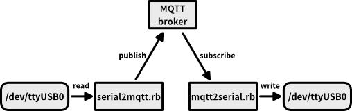

mqtt-serial
====

setup
----

    $ gem install mqtt serialport
    $ mkdir -p ~/work/
    $ cd ~/work/
    $ git clone https://github.com/yoggy/mqtt-serial.git
    $ cd mqtt-serial

serial2mqtt.rb
----

    $ ./serial2mqtt.rb
    
    usage : ./serial2mqtt.rb serialport bps host port publish_topic
 
    example :
    
        $ ./serial2mqtt.rb /dev/ttyUSB0 9600 localhost 1883 topic/recv

mqtt2serial.rb
----

    $ ./mqtt2serial.rb

    usage : ./mqtt2serial.rb host port subscribe_topic serialport bps
 
    example :
    
        $ ./mqtt2serial.rb localhost 1883 topic/recv /dev/ttyUSB1 9600

Copyright and license
----
Copyright (c) 2018 yoggy

Released under the [MIT license](LICENSE.txt)

